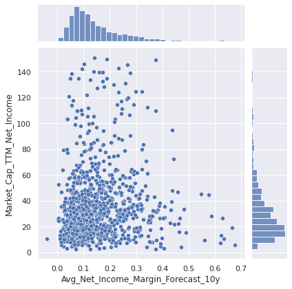

# Price to Earnings Ratio Prediction
A traditional measure of whether a stock is expensive or cheap, is to use a valuation multiple. A valuation multiple relates the market value of an asset relative to a key statistic that is assumed to relate to that value. To be useful, that statistic – whether earnings, cash flow or some other measure – must bear a logical relationship to the market value observed; to be seen, in fact, as the driver of that market value. For more information about valuation multiples, refer to below link: <https://en.wikipedia.org/wiki/Valuation_using_multiples#Valuation_multiples>


## 1. Price to Earnings Ratio

The most famous valuation multiple the PE (Price to earnings) ratio. This is the ratio between the market value of all the shares outstanding for a company, divided by the company’s Net Income. It is often also defined as Price per share divided by earnings per share, which is simply dividing both the Market Capitalization and the Net income by the shares outstanding.
In this project we will try to predict the PE ratios for the 3000 biggest companies listed on the US stock exchanges.

Before analysing our dataset, let us first try to understand what fundamental financial information about the company should be driving the PE ratio based on Financial Theory.

The present value of any Cash Flow generating asset is the value of all future cash flows the asset will generate over its lifetime, discounted back to today with a risk adjusted interest rate.

In its simplest form, where we expect the cash flow (CF) to grow at the same rate for ever (g), the present value (PV) is calculated with below perpetuity formula.

$PV = \frac{CF * (1+g)}{(r-g)}$

When trying to value a company based on its future cash flows, we can either look at it through the lenses of all capital providers (equity and debt providers) and we would use the FCFF (Free Cash Flow to the Firm) as the measure of cash flow (CF), or we could look at it purely as an Equity investor and we would use the FCFE (Free Cash Flow to Equity) as our measure of CF.

The main difference is that the FCFF is the cash flow left over after cash flow needs for operations and Investments are met, but before any debt repayments, whereas the FCFE is after debt payments (cash flow left over for equity investors).

If we want to estimate the value of Equity directly, we would therefore use the FCFE as the appropriate measure of CF.

As the Market Capitalization (MC) (numerator in the PE ratio), is the aggregate market estimation of the value of Equity, we can rewrite the above formula as follows:

$MC = \frac{FCFE*(1 + g)}{(r - g)}$<br><br>

FCFE can be rewritten as:<br><br>

$MC = \frac{(NetIncome+DA-CAPEX-deltaWC-NetDebtRepayment)*(1 + g)}{(r - g)}$<br><br>


Re-writing the numerator relative to Net Income gives us:<br><br>

$MC = \frac{NetIncome*(1+\frac{DA}{Net Income}-\frac{CAPEX}{Net Income}-\frac{deltaWC}{Net Income}-\frac{NetDebtRepayment}{Net Income})*(1 + g)}{(r - g)}$<br>

$MC = \frac{NetIncome*(1-\frac{CAPEX - DA + deltaWC}{Net Income}-\frac{NetDebtRepayment}{Net Income})*(1 + g)}{(r - g)}$<br>

$MC = \frac{NetIncome*(1-\frac{reInvestment}{Net Income}-\frac{NetDebtRepayment}{Net Income})*(1 + g)}{(r - g)}$<br><br>

Deviding both sides by the Net Income (Earnings), gives us the Price to Earnings ratio:<br><br>
$\frac{Price}{Earnings}=\frac{MC}{NetIncome}= \frac{\frac{NetIncome*(1-\frac{reInvestment}{Net Income}-\frac{NetDebtRepayment}{Net Income})*(1 + g)}{(r - g)}}{Net Income}$<br>

$\frac{Price}{Earnings}=\frac{MC}{NetIncome}= \frac{(1-\frac{reInvestment}{Net Income}-\frac{NetDebtRepayment}{Net Income})*(1 + g)}{(r - g)}$<br><br>

Finally converting the discount rate r to the cost of equity gives us:<br><br>
$\frac{Price}{Earnings}=\frac{MC}{NetIncome}= \frac{(1-\frac{reInvestment}{Net Income}-\frac{NetDebtRepayment}{Net Income})*(1 + g)}{((rf+\beta*ERP) - g)}$<br><br>

This formula gives us some understanding of what we would expect the fundamental drivers of the PE ratio to be.
The fundamental drivers of the P/E ratio are
1. A higher expected growth rate g, all else being equal, should lead to a higher PE ratio
2. A lower reinvestment need (Capex - depreciation + delta working capital), all else being equal, should lead to a higher PE ratio
3. Lower amount of debt needed (Net Debt repayments), all else being equal, should result in a higher PE ratio
4. A higher risk relative to the overall market, measured as beta in the denominator, should lead to a lower PE ratio

rf (risk free rate traditionally measured as the US T-Bond rate) and ERP (Equity risk premium, basically the premium that equity investor require on top of the risk free rate for investing in the overall stock market) values are the same for all stocks, therefore changes in these overall market metrics will affect all PE ratios, but these will not help differentiation between PE ratios of individual companies, as these are equal for all companies.

We will therefore try to obtain financial metrics that are related to points 1-4, as we would expect these to be partial drivers of the PE ratios seeen in the market.

## 2. Data Extraction and Pre-Processing
The company data was downloaded from the data provider "Finbox".
For more information, refer to below link:
<https://finbox.com>

We will first import the data and check for any missing values and some basic information.
Then we will remove outliers before splitting the data into training and testing sets, and analysing the training set in more detail.


```python
# linear algebra
import numpy as np     

# data processing
import pandas as pd    
#display max columns and rows, to be able to inspect big data tables
pd.set_option('display.max_columns', None)
pd.set_option('display.max_rows', None)

#data visualization
import matplotlib.pyplot as plt
import seaborn as sns
sns.set_theme()
```


```python
# conntects to google drive if ran in colab
# ignored if ran outside of colab

if 'google.colab' in str(get_ipython()):
  from google.colab import drive
  drive.mount('/content/drive')
```

    Drive already mounted at /content/drive; to attempt to forcibly remount, call drive.mount("/content/drive", force_remount=True).
    


```python
# load file from google drive path, if ran in colab 
# load file from notebook folder, if ran outside colab

if 'google.colab' in str(get_ipython()):
    path = '/content/drive/My Drive/Colab Notebooks/stock_pricing/'
else:
    path = str()
file = path + 'large_Financials_unlinked.xlsm'

company_data = pd.read_excel(file)
```


```python
#original data structure
company_data.head(5)
```


<div>
<style scoped>
    .dataframe tbody tr th:only-of-type {
        vertical-align: middle;
    }

    .dataframe tbody tr th {
        vertical-align: top;
    }

    .dataframe thead th {
        text-align: right;
    }
</style>
<table border="1" class="dataframe">
  <thead>
    <tr style="text-align: right;">
      <th></th>
      <th>Ticker</th>
      <th>Full_Ticker</th>
      <th>Name</th>
      <th>Sector</th>
      <th>Industry_GICS</th>
      <th>Index_Membership</th>
      <th>Market_Cap</th>
      <th>Net_Debt</th>
      <th>Minority_Interest</th>
      <th>EV</th>
      <th>EBITDA</th>
      <th>Net_Income</th>
      <th>Equity</th>
      <th>Avg_EBITDA_Margin_Forecast_10y</th>
      <th>EBITDA_Forecast_CAGR_10y</th>
      <th>Avg_Net_Income_Margin_Forecast_10y</th>
      <th>Net_Income_Forecast_CAGR_10y</th>
      <th>ROE</th>
      <th>Beta_5y</th>
      <th>Net_Debt_perc_EV</th>
      <th>EV_TTM_EBITDA</th>
      <th>Market_Cap_TTM_Net_Income</th>
      <th>Market_Cap_BV_Equity</th>
      <th>Net_Debt_perc_Market_Cap</th>
    </tr>
  </thead>
  <tbody>
    <tr>
      <th>0</th>
      <td>AAPL</td>
      <td>NASDAQGS:AAPL</td>
      <td>Apple Inc.</td>
      <td>Information Technology</td>
      <td>Technology Hardware, Storage &amp; Peripherals</td>
      <td>Dow Jones Composite Average, Dow Jones Industr...</td>
      <td>2.166836e+06</td>
      <td>-69552.0</td>
      <td>0.0</td>
      <td>2.097284e+06</td>
      <td>77344.0</td>
      <td>57411.0</td>
      <td>65339.0</td>
      <td>0.28493</td>
      <td>0.0381633</td>
      <td>0.206377</td>
      <td>0.0348267</td>
      <td>0.736856</td>
      <td>1.283613</td>
      <td>-0.033163</td>
      <td>27.116315</td>
      <td>37.742528</td>
      <td>33.162985</td>
      <td>-0.032098</td>
    </tr>
    <tr>
      <th>1</th>
      <td>AMZN</td>
      <td>NASDAQGS:AMZN</td>
      <td>Amazon.com, Inc.</td>
      <td>Consumer Discretionary</td>
      <td>Internet &amp; Direct Marketing Retail</td>
      <td>Nasdaq 100, Nasdaq Composite, Russell 1000, Ru...</td>
      <td>1.565880e+06</td>
      <td>28412.0</td>
      <td>0.0</td>
      <td>1.594292e+06</td>
      <td>43708.0</td>
      <td>17377.0</td>
      <td>82775.0</td>
      <td>0.183412</td>
      <td>0.145604</td>
      <td>0.0865852</td>
      <td>0.201361</td>
      <td>0.249521</td>
      <td>1.198004</td>
      <td>0.017821</td>
      <td>36.475980</td>
      <td>90.112226</td>
      <td>18.917308</td>
      <td>0.018144</td>
    </tr>
    <tr>
      <th>2</th>
      <td>MSFT</td>
      <td>NASDAQGS:MSFT</td>
      <td>Microsoft Corporation</td>
      <td>Information Technology</td>
      <td>Software</td>
      <td>Dow Jones Composite Average, Dow Jones Industr...</td>
      <td>1.624977e+06</td>
      <td>-54733.0</td>
      <td>0.0</td>
      <td>1.570244e+06</td>
      <td>68123.0</td>
      <td>47496.0</td>
      <td>123392.0</td>
      <td>0.475806</td>
      <td>0.0485504</td>
      <td>0.324014</td>
      <td>0.048353</td>
      <td>0.413993</td>
      <td>0.826155</td>
      <td>-0.034856</td>
      <td>23.050136</td>
      <td>34.212932</td>
      <td>13.169228</td>
      <td>-0.033682</td>
    </tr>
    <tr>
      <th>3</th>
      <td>GOOG</td>
      <td>NASDAQGS:GOOG</td>
      <td>Alphabet Inc.</td>
      <td>Communication Services</td>
      <td>Interactive Media &amp; Services</td>
      <td>Nasdaq 100, Nasdaq Composite, Russell 1000, Ru...</td>
      <td>1.178252e+06</td>
      <td>-105501.0</td>
      <td>0.0</td>
      <td>1.072751e+06</td>
      <td>48075.0</td>
      <td>35713.0</td>
      <td>212920.0</td>
      <td>0.381029</td>
      <td>0.107043</td>
      <td>0.260145</td>
      <td>0.110387</td>
      <td>0.175111</td>
      <td>0.994747</td>
      <td>-0.098346</td>
      <td>22.314107</td>
      <td>32.992235</td>
      <td>5.533776</td>
      <td>-0.089540</td>
    </tr>
    <tr>
      <th>4</th>
      <td>FB</td>
      <td>NASDAQGS:FB</td>
      <td>Facebook, Inc.</td>
      <td>Communication Services</td>
      <td>Interactive Media &amp; Services</td>
      <td>Nasdaq 100, Nasdaq Composite, Russell 1000, Ru...</td>
      <td>7.151778e+05</td>
      <td>-44476.0</td>
      <td>0.0</td>
      <td>6.707018e+05</td>
      <td>30221.0</td>
      <td>25276.0</td>
      <td>117731.0</td>
      <td>0.530226</td>
      <td>0.119821</td>
      <td>0.351485</td>
      <td>0.131987</td>
      <td>0.238757</td>
      <td>1.182773</td>
      <td>-0.066313</td>
      <td>22.193237</td>
      <td>28.294738</td>
      <td>6.074677</td>
      <td>-0.062189</td>
    </tr>
  </tbody>
</table>
</div>


### 2.1 Data Structure and removal of not meaningful samples


```python
#original data shape
original_data_shape = company_data.shape
print('The original data shape is', original_data_shape)
```

    The original data shape is (3171, 24)
    


```python
#drop duplicates
company_data = company_data.drop_duplicates('Name' , keep='first')
print(original_data_shape[0] - company_data.shape[0], 'companies were removed due to duplication.')
print('The new data shape is', company_data.shape)
```

    21 companies were removed due to duplication.
    The new data shape is (3150, 24)
    


```python
#remove not meaningful samples
current_num_samples = company_data.shape[0]
company_data = company_data[(company_data.Market_Cap > 0)]
company_data = company_data[(company_data.Net_Income > 0)]
new_num_samples = company_data.shape[0]
print(current_num_samples - new_num_samples, 'companies were removed due to not meaningful data.')
print('The new data shape is', company_data.shape)
```

    1317 companies were removed due to not meaningful data.
    The new data shape is (1833, 24)
    


```python
#filter data for required columns
pe_data = company_data[['Sector', 
                        'Name', 
                        'Market_Cap_TTM_Net_Income', 
                        'Net_Income_Forecast_CAGR_10y',
                        'Avg_Net_Income_Margin_Forecast_10y', 
                        'Beta_5y', 
                        'Net_Debt_perc_Market_Cap'
                       ]].set_index('Name')
pe_data.head(5)
```


<div>
<style scoped>
    .dataframe tbody tr th:only-of-type {
        vertical-align: middle;
    }

    .dataframe tbody tr th {
        vertical-align: top;
    }

    .dataframe thead th {
        text-align: right;
    }
</style>
<table border="1" class="dataframe">
  <thead>
    <tr style="text-align: right;">
      <th></th>
      <th>Sector</th>
      <th>Market_Cap_TTM_Net_Income</th>
      <th>Net_Income_Forecast_CAGR_10y</th>
      <th>Avg_Net_Income_Margin_Forecast_10y</th>
      <th>Beta_5y</th>
      <th>Net_Debt_perc_Market_Cap</th>
    </tr>
    <tr>
      <th>Name</th>
      <th></th>
      <th></th>
      <th></th>
      <th></th>
      <th></th>
      <th></th>
    </tr>
  </thead>
  <tbody>
    <tr>
      <th>Apple Inc.</th>
      <td>Information Technology</td>
      <td>37.742528</td>
      <td>0.0348267</td>
      <td>0.206377</td>
      <td>1.283613</td>
      <td>-0.032098</td>
    </tr>
    <tr>
      <th>Amazon.com, Inc.</th>
      <td>Consumer Discretionary</td>
      <td>90.112226</td>
      <td>0.201361</td>
      <td>0.0865852</td>
      <td>1.198004</td>
      <td>0.018144</td>
    </tr>
    <tr>
      <th>Microsoft Corporation</th>
      <td>Information Technology</td>
      <td>34.212932</td>
      <td>0.048353</td>
      <td>0.324014</td>
      <td>0.826155</td>
      <td>-0.033682</td>
    </tr>
    <tr>
      <th>Alphabet Inc.</th>
      <td>Communication Services</td>
      <td>32.992235</td>
      <td>0.110387</td>
      <td>0.260145</td>
      <td>0.994747</td>
      <td>-0.089540</td>
    </tr>
    <tr>
      <th>Facebook, Inc.</th>
      <td>Communication Services</td>
      <td>28.294738</td>
      <td>0.131987</td>
      <td>0.351485</td>
      <td>1.182773</td>
      <td>-0.062189</td>
    </tr>
  </tbody>
</table>
</div>


```python
#check column data types
pe_data.info()
```

    <class 'pandas.core.frame.DataFrame'>
    Index: 1833 entries, Apple Inc. to Smart Sand, Inc.
    Data columns (total 6 columns):
     #   Column                              Non-Null Count  Dtype  
    ---  ------                              --------------  -----  
     0   Sector                              1833 non-null   object 
     1   Market_Cap_TTM_Net_Income           1833 non-null   float64
     2   Net_Income_Forecast_CAGR_10y        1833 non-null   object 
     3   Avg_Net_Income_Margin_Forecast_10y  1833 non-null   object 
     4   Beta_5y                             1833 non-null   float64
     5   Net_Debt_perc_Market_Cap            1833 non-null   float64
    dtypes: float64(3), object(3)
    memory usage: 100.2+ KB
    


```python
#ensure columns have the correct data type
pe_data['Market_Cap_TTM_Net_Income'] = pe_data['Market_Cap_TTM_Net_Income'].apply(pd.to_numeric, errors='coerce')
pe_data['Net_Income_Forecast_CAGR_10y'] = pe_data['Net_Income_Forecast_CAGR_10y'].apply(pd.to_numeric, errors='coerce')
pe_data['Avg_Net_Income_Margin_Forecast_10y'] = pe_data['Avg_Net_Income_Margin_Forecast_10y'].apply(pd.to_numeric, errors='coerce')
pe_data['Beta_5y'] = pe_data['Beta_5y'].apply(pd.to_numeric, errors='coerce')
pe_data['Net_Debt_perc_Market_Cap'] = pe_data['Net_Debt_perc_Market_Cap'].apply(pd.to_numeric, errors='coerce')
```


```python
pe_data.info()
```

    <class 'pandas.core.frame.DataFrame'>
    Index: 1833 entries, Apple Inc. to Smart Sand, Inc.
    Data columns (total 6 columns):
     #   Column                              Non-Null Count  Dtype  
    ---  ------                              --------------  -----  
     0   Sector                              1833 non-null   object 
     1   Market_Cap_TTM_Net_Income           1833 non-null   float64
     2   Net_Income_Forecast_CAGR_10y        1562 non-null   float64
     3   Avg_Net_Income_Margin_Forecast_10y  1831 non-null   float64
     4   Beta_5y                             1833 non-null   float64
     5   Net_Debt_perc_Market_Cap            1833 non-null   float64
    dtypes: float64(5), object(1)
    memory usage: 100.2+ KB
    


```python
#check for missing values
pe_data.isna().sum()
```


    Sector                                  0
    Market_Cap_TTM_Net_Income               0
    Net_Income_Forecast_CAGR_10y          271
    Avg_Net_Income_Margin_Forecast_10y      2
    Beta_5y                                 0
    Net_Debt_perc_Market_Cap                0
    dtype: int64


```python
#remove missing values
current_num_samples = pe_data.shape[0]
pe_data = pe_data.dropna()
pe_data.isna().sum()
new_num_samples = pe_data.shape[0]
print(current_num_samples - new_num_samples, 'companies were removed due to missing data.')
print('The new data shape is', pe_data.shape)
```

    271 companies were removed due to missing data.
    The new data shape is (1562, 6)
    

### 2.2 Inspection for Outliers
We will look at the individual histograms of all variables, to see if we have potential outliers, and use Gaussian mixture models to later remove these outliers.

### 2.2.1 Summary Statistics and Histograms


```python
#summary statistics before outlier removal
pe_data.describe()
```


<div>
<style scoped>
    .dataframe tbody tr th:only-of-type {
        vertical-align: middle;
    }

    .dataframe tbody tr th {
        vertical-align: top;
    }

    .dataframe thead th {
        text-align: right;
    }
</style>
<table border="1" class="dataframe">
  <thead>
    <tr style="text-align: right;">
      <th></th>
      <th>Market_Cap_TTM_Net_Income</th>
      <th>Net_Income_Forecast_CAGR_10y</th>
      <th>Avg_Net_Income_Margin_Forecast_10y</th>
      <th>Beta_5y</th>
      <th>Net_Debt_perc_Market_Cap</th>
    </tr>
  </thead>
  <tbody>
    <tr>
      <th>count</th>
      <td>1562.000000</td>
      <td>1562.000000</td>
      <td>1562.000000</td>
      <td>1562.000000</td>
      <td>1562.000000</td>
    </tr>
    <tr>
      <th>mean</th>
      <td>88.873737</td>
      <td>0.040772</td>
      <td>0.150340</td>
      <td>1.074986</td>
      <td>0.325119</td>
    </tr>
    <tr>
      <th>std</th>
      <td>783.710029</td>
      <td>0.132170</td>
      <td>0.127199</td>
      <td>0.559106</td>
      <td>1.627939</td>
    </tr>
    <tr>
      <th>min</th>
      <td>0.706985</td>
      <td>-0.342594</td>
      <td>-0.038680</td>
      <td>-1.269432</td>
      <td>-6.197720</td>
    </tr>
    <tr>
      <th>25%</th>
      <td>15.490751</td>
      <td>0.008678</td>
      <td>0.075073</td>
      <td>0.724133</td>
      <td>-0.020051</td>
    </tr>
    <tr>
      <th>50%</th>
      <td>25.771183</td>
      <td>0.046963</td>
      <td>0.114935</td>
      <td>1.060399</td>
      <td>0.116504</td>
    </tr>
    <tr>
      <th>75%</th>
      <td>45.413055</td>
      <td>0.093754</td>
      <td>0.188474</td>
      <td>1.407431</td>
      <td>0.371820</td>
    </tr>
    <tr>
      <th>max</th>
      <td>25745.355250</td>
      <td>0.958556</td>
      <td>1.941181</td>
      <td>3.187500</td>
      <td>40.707549</td>
    </tr>
  </tbody>
</table>
</div>


```python
sns.histplot(pe_data[['Market_Cap_TTM_Net_Income']])
```


    <matplotlib.axes._subplots.AxesSubplot at 0x7f8ab7fa1b00>


    

    


```python
sns.histplot(np.log(pe_data[['Market_Cap_TTM_Net_Income']]))
```


    <matplotlib.axes._subplots.AxesSubplot at 0x7f8ab53741d0>


    

    


```python
sns.histplot(pe_data[['Net_Income_Forecast_CAGR_10y']])
```


    <matplotlib.axes._subplots.AxesSubplot at 0x7f8ab88663c8>


    

    


```python
sns.histplot(pe_data[['Avg_Net_Income_Margin_Forecast_10y']])
```


    <matplotlib.axes._subplots.AxesSubplot at 0x7f8ab898e908>


    

    


```python
sns.histplot(pe_data[['Beta_5y']])
```


    <matplotlib.axes._subplots.AxesSubplot at 0x7f8ab4946630>


    

    


```python
sns.histplot(pe_data[['Net_Debt_perc_Market_Cap']])
```


    <matplotlib.axes._subplots.AxesSubplot at 0x7f8ab4ba8c18>


    

    


### 2.2.2 Outlier Removal with Gaussian Mixtures


```python
#check for outliers with multivariate Guassian
from sklearn.covariance import EllipticEnvelope

X = pe_data[['Market_Cap_TTM_Net_Income',
 'Net_Income_Forecast_CAGR_10y',
 'Avg_Net_Income_Margin_Forecast_10y',
 'Beta_5y',
 'Net_Debt_perc_Market_Cap']]
cov = EllipticEnvelope(random_state=0, contamination=0.1).fit(X)
# predict returns 1 for an inlier and -1 for an outlier
pe_data[cov.predict(X)== -1]
```


<div>
<style scoped>
    .dataframe tbody tr th:only-of-type {
        vertical-align: middle;
    }

    .dataframe tbody tr th {
        vertical-align: top;
    }

    .dataframe thead th {
        text-align: right;
    }
</style>
<table border="1" class="dataframe">
  <thead>
    <tr style="text-align: right;">
      <th></th>
      <th>Sector</th>
      <th>Market_Cap_TTM_Net_Income</th>
      <th>Net_Income_Forecast_CAGR_10y</th>
      <th>Avg_Net_Income_Margin_Forecast_10y</th>
      <th>Beta_5y</th>
      <th>Net_Debt_perc_Market_Cap</th>
    </tr>
    <tr>
      <th>Name</th>
      <th></th>
      <th></th>
      <th></th>
      <th></th>
      <th></th>
      <th></th>
    </tr>
  </thead>
  <tbody>
    <tr>
      <th>JPMorgan Chase &amp; Co.</th>
      <td>Financials</td>
      <td>16.751677</td>
      <td>-0.308714</td>
      <td>0.076850</td>
      <td>1.221113</td>
      <td>-1.502979</td>
    </tr>
    <tr>
      <th>salesforce.com, inc.</th>
      <td>Information Technology</td>
      <td>55.467165</td>
      <td>0.494147</td>
      <td>0.167470</td>
      <td>1.171743</td>
      <td>-0.016569</td>
    </tr>
    <tr>
      <th>Zoom Video Communications, Inc.</th>
      <td>Information Technology</td>
      <td>238.968203</td>
      <td>0.548485</td>
      <td>0.294907</td>
      <td>0.000000</td>
      <td>-0.017654</td>
    </tr>
    <tr>
      <th>Citigroup Inc.</th>
      <td>Financials</td>
      <td>11.521894</td>
      <td>-0.249653</td>
      <td>0.058769</td>
      <td>1.951680</td>
      <td>-2.650639</td>
    </tr>
    <tr>
      <th>Morgan Stanley</th>
      <td>Financials</td>
      <td>13.922561</td>
      <td>-0.189029</td>
      <td>0.076157</td>
      <td>1.578256</td>
      <td>-2.002738</td>
    </tr>
    <tr>
      <th>Square, Inc.</th>
      <td>Information Technology</td>
      <td>330.866730</td>
      <td>0.287034</td>
      <td>0.169256</td>
      <td>2.710084</td>
      <td>-0.002075</td>
    </tr>
    <tr>
      <th>The Goldman Sachs Group, Inc.</th>
      <td>Financials</td>
      <td>15.782209</td>
      <td>-0.147498</td>
      <td>0.094139</td>
      <td>1.498424</td>
      <td>-2.264476</td>
    </tr>
    <tr>
      <th>Autodesk, Inc.</th>
      <td>Information Technology</td>
      <td>164.201527</td>
      <td>0.267383</td>
      <td>0.312567</td>
      <td>1.440651</td>
      <td>0.006867</td>
    </tr>
    <tr>
      <th>Rocket Companies, Inc.</th>
      <td>Financials</td>
      <td>2.379811</td>
      <td>0.133660</td>
      <td>0.335283</td>
      <td>0.000000</td>
      <td>10.451434</td>
    </tr>
    <tr>
      <th>Chipotle Mexican Grill, Inc.</th>
      <td>Consumer Discretionary</td>
      <td>165.322824</td>
      <td>0.112505</td>
      <td>0.097372</td>
      <td>1.310399</td>
      <td>0.053183</td>
    </tr>
    <tr>
      <th>Match Group, Inc.</th>
      <td>Communication Services</td>
      <td>462.034079</td>
      <td>0.122597</td>
      <td>0.289083</td>
      <td>0.000000</td>
      <td>0.078802</td>
    </tr>
    <tr>
      <th>IQVIA Holdings Inc.</th>
      <td>Healthcare</td>
      <td>206.344869</td>
      <td>0.217596</td>
      <td>0.096187</td>
      <td>1.408088</td>
      <td>0.317127</td>
    </tr>
    <tr>
      <th>Marriott International, Inc.</th>
      <td>Consumer Discretionary</td>
      <td>234.753507</td>
      <td>0.088121</td>
      <td>0.321391</td>
      <td>1.828256</td>
      <td>0.251279</td>
    </tr>
    <tr>
      <th>The Trade Desk, Inc.</th>
      <td>Information Technology</td>
      <td>267.645982</td>
      <td>0.262910</td>
      <td>0.426602</td>
      <td>2.571428</td>
      <td>-0.006479</td>
    </tr>
    <tr>
      <th>Kinder Morgan, Inc.</th>
      <td>Energy</td>
      <td>282.232013</td>
      <td>0.024985</td>
      <td>0.214225</td>
      <td>0.973214</td>
      <td>0.988606</td>
    </tr>
    <tr>
      <th>Yandex N.V.</th>
      <td>Communication Services</td>
      <td>0.956178</td>
      <td>0.247145</td>
      <td>0.151302</td>
      <td>1.418067</td>
      <td>-6.197720</td>
    </tr>
    <tr>
      <th>GoodRx Holdings, Inc.</th>
      <td>Healthcare</td>
      <td>859.767452</td>
      <td>0.275670</td>
      <td>0.265819</td>
      <td>0.000000</td>
      <td>-0.019991</td>
    </tr>
    <tr>
      <th>Altice USA, Inc.</th>
      <td>Communication Services</td>
      <td>180.741036</td>
      <td>0.214488</td>
      <td>0.077281</td>
      <td>1.117957</td>
      <td>1.366004</td>
    </tr>
    <tr>
      <th>Insulet Corporation</th>
      <td>Healthcare</td>
      <td>606.399539</td>
      <td>0.347631</td>
      <td>0.115667</td>
      <td>0.753676</td>
      <td>0.001678</td>
    </tr>
    <tr>
      <th>Royalty Pharma plc</th>
      <td>Healthcare</td>
      <td>8.626940</td>
      <td>-0.018368</td>
      <td>0.783479</td>
      <td>0.000000</td>
      <td>0.189492</td>
    </tr>
    <tr>
      <th>Ceridian HCM Holding Inc.</th>
      <td>Information Technology</td>
      <td>1274.738272</td>
      <td>0.106253</td>
      <td>0.126695</td>
      <td>1.383878</td>
      <td>0.030229</td>
    </tr>
    <tr>
      <th>PPD, Inc.</th>
      <td>Healthcare</td>
      <td>176.904951</td>
      <td>0.242234</td>
      <td>0.081675</td>
      <td>0.000000</td>
      <td>0.303869</td>
    </tr>
    <tr>
      <th>Sunrun Inc.</th>
      <td>Industrials</td>
      <td>2190.510881</td>
      <td>0.389808</td>
      <td>0.280920</td>
      <td>2.331932</td>
      <td>0.148653</td>
    </tr>
    <tr>
      <th>Paylocity Holding Corporation</th>
      <td>Information Technology</td>
      <td>168.748963</td>
      <td>0.125200</td>
      <td>0.187379</td>
      <td>1.358193</td>
      <td>-0.005702</td>
    </tr>
    <tr>
      <th>Vail Resorts, Inc.</th>
      <td>Consumer Discretionary</td>
      <td>221.809841</td>
      <td>0.203086</td>
      <td>0.134174</td>
      <td>1.267857</td>
      <td>0.195811</td>
    </tr>
    <tr>
      <th>Nuance Communications, Inc.</th>
      <td>Information Technology</td>
      <td>638.474079</td>
      <td>0.241816</td>
      <td>0.151574</td>
      <td>1.207983</td>
      <td>0.095179</td>
    </tr>
    <tr>
      <th>Repligen Corporation</th>
      <td>Healthcare</td>
      <td>255.814324</td>
      <td>0.210457</td>
      <td>0.197374</td>
      <td>0.937500</td>
      <td>-0.025107</td>
    </tr>
    <tr>
      <th>Globant S.A.</th>
      <td>Information Technology</td>
      <td>175.746339</td>
      <td>0.169668</td>
      <td>0.147179</td>
      <td>1.241071</td>
      <td>-0.028297</td>
    </tr>
    <tr>
      <th>JOYY Inc.</th>
      <td>Communication Services</td>
      <td>0.712293</td>
      <td>0.054680</td>
      <td>0.122382</td>
      <td>1.025735</td>
      <td>-2.524629</td>
    </tr>
    <tr>
      <th>Santander Consumer USA Holdings Inc.</th>
      <td>Financials</td>
      <td>12.545485</td>
      <td>-0.294670</td>
      <td>0.047224</td>
      <td>1.146533</td>
      <td>6.150640</td>
    </tr>
    <tr>
      <th>Regency Centers Corporation</th>
      <td>Real Estate</td>
      <td>162.169055</td>
      <td>0.025364</td>
      <td>0.218645</td>
      <td>1.025210</td>
      <td>0.520654</td>
    </tr>
    <tr>
      <th>Post Holdings, Inc.</th>
      <td>Consumer Staples</td>
      <td>8049.723862</td>
      <td>0.840637</td>
      <td>0.050039</td>
      <td>0.713760</td>
      <td>1.006789</td>
    </tr>
    <tr>
      <th>Polaris Inc.</th>
      <td>Consumer Discretionary</td>
      <td>272.459252</td>
      <td>0.089551</td>
      <td>0.079538</td>
      <td>2.051995</td>
      <td>0.172279</td>
    </tr>
    <tr>
      <th>RealPage, Inc.</th>
      <td>Information Technology</td>
      <td>160.502484</td>
      <td>0.168698</td>
      <td>0.163460</td>
      <td>1.200105</td>
      <td>0.083945</td>
    </tr>
    <tr>
      <th>Healthcare Trust of America, Inc.</th>
      <td>Real Estate</td>
      <td>174.044302</td>
      <td>0.134457</td>
      <td>0.107783</td>
      <td>0.570378</td>
      <td>0.518029</td>
    </tr>
    <tr>
      <th>East West Bancorp, Inc.</th>
      <td>Financials</td>
      <td>14.698616</td>
      <td>-0.327636</td>
      <td>0.112202</td>
      <td>1.983193</td>
      <td>-0.455557</td>
    </tr>
    <tr>
      <th>Jefferies Financial Group Inc.</th>
      <td>Financials</td>
      <td>8.585564</td>
      <td>-0.017036</td>
      <td>0.107537</td>
      <td>1.452205</td>
      <td>3.113440</td>
    </tr>
    <tr>
      <th>Planet Fitness, Inc.</th>
      <td>Consumer Discretionary</td>
      <td>1145.056270</td>
      <td>0.080519</td>
      <td>0.200777</td>
      <td>1.278886</td>
      <td>0.224182</td>
    </tr>
    <tr>
      <th>OneMain Holdings, Inc.</th>
      <td>Financials</td>
      <td>10.945856</td>
      <td>-0.015186</td>
      <td>0.196724</td>
      <td>2.301995</td>
      <td>2.253179</td>
    </tr>
    <tr>
      <th>Euronet Worldwide, Inc.</th>
      <td>Information Technology</td>
      <td>231.647933</td>
      <td>0.049857</td>
      <td>0.129901</td>
      <td>1.603991</td>
      <td>-0.015695</td>
    </tr>
    <tr>
      <th>DouYu International Holdings Limited</th>
      <td>Communication Services</td>
      <td>4.487869</td>
      <td>0.598024</td>
      <td>0.149220</td>
      <td>0.000000</td>
      <td>-2.052381</td>
    </tr>
    <tr>
      <th>Apartment Investment and Management Company</th>
      <td>Real Estate</td>
      <td>4.815010</td>
      <td>-0.262892</td>
      <td>0.014636</td>
      <td>0.504201</td>
      <td>5.617434</td>
    </tr>
    <tr>
      <th>51job, Inc.</th>
      <td>Industrials</td>
      <td>4.695607</td>
      <td>0.142755</td>
      <td>0.367819</td>
      <td>0.773634</td>
      <td>-2.131473</td>
    </tr>
    <tr>
      <th>TFS Financial Corporation</th>
      <td>Financials</td>
      <td>63.557578</td>
      <td>-0.303970</td>
      <td>0.065285</td>
      <td>0.473214</td>
      <td>0.582566</td>
    </tr>
    <tr>
      <th>Silicon Laboratories Inc.</th>
      <td>Information Technology</td>
      <td>440.317690</td>
      <td>0.246578</td>
      <td>0.149803</td>
      <td>1.061449</td>
      <td>-0.027344</td>
    </tr>
    <tr>
      <th>Futu Holdings Limited</th>
      <td>Financials</td>
      <td>11.461593</td>
      <td>0.375405</td>
      <td>0.399249</td>
      <td>0.000000</td>
      <td>3.088148</td>
    </tr>
    <tr>
      <th>Cullen/Frost Bankers, Inc.</th>
      <td>Financials</td>
      <td>17.665053</td>
      <td>-0.313444</td>
      <td>0.064631</td>
      <td>1.550420</td>
      <td>-0.823118</td>
    </tr>
    <tr>
      <th>CyberArk Software Ltd.</th>
      <td>Information Technology</td>
      <td>2150.226566</td>
      <td>0.013283</td>
      <td>0.112798</td>
      <td>1.372899</td>
      <td>-0.099157</td>
    </tr>
    <tr>
      <th>Inovalon Holdings, Inc.</th>
      <td>Healthcare</td>
      <td>675.318101</td>
      <td>0.385118</td>
      <td>0.179341</td>
      <td>0.631302</td>
      <td>0.231589</td>
    </tr>
    <tr>
      <th>New York Community Bancorp, Inc.</th>
      <td>Financials</td>
      <td>12.140423</td>
      <td>-0.157636</td>
      <td>0.140916</td>
      <td>1.053046</td>
      <td>2.825336</td>
    </tr>
    <tr>
      <th>PennyMac Financial Services, Inc.</th>
      <td>Financials</td>
      <td>3.108653</td>
      <td>-0.006878</td>
      <td>0.183363</td>
      <td>1.210084</td>
      <td>6.173266</td>
    </tr>
    <tr>
      <th>Affiliated Managers Group, Inc.</th>
      <td>Financials</td>
      <td>45.356890</td>
      <td>0.487594</td>
      <td>0.332176</td>
      <td>1.448004</td>
      <td>0.312858</td>
    </tr>
    <tr>
      <th>Vicor Corporation</th>
      <td>Industrials</td>
      <td>554.240278</td>
      <td>0.286143</td>
      <td>0.239396</td>
      <td>0.838235</td>
      <td>-0.044756</td>
    </tr>
    <tr>
      <th>STAAR Surgical Company</th>
      <td>Healthcare</td>
      <td>459.804971</td>
      <td>0.204366</td>
      <td>0.187577</td>
      <td>1.080882</td>
      <td>-0.028797</td>
    </tr>
    <tr>
      <th>Quaker Chemical Corporation</th>
      <td>Materials</td>
      <td>758.979339</td>
      <td>0.208738</td>
      <td>0.101672</td>
      <td>1.521008</td>
      <td>0.158539</td>
    </tr>
    <tr>
      <th>H&amp;R Block, Inc.</th>
      <td>Consumer Discretionary</td>
      <td>15.135832</td>
      <td>0.547058</td>
      <td>0.140034</td>
      <td>0.717436</td>
      <td>0.603042</td>
    </tr>
    <tr>
      <th>Momo Inc.</th>
      <td>Communication Services</td>
      <td>1.284078</td>
      <td>-0.018558</td>
      <td>0.135815</td>
      <td>1.501050</td>
      <td>-1.913612</td>
    </tr>
    <tr>
      <th>Verint Systems Inc.</th>
      <td>Information Technology</td>
      <td>266.448316</td>
      <td>0.273125</td>
      <td>0.189768</td>
      <td>0.882878</td>
      <td>0.054453</td>
    </tr>
    <tr>
      <th>Air Lease Corporation</th>
      <td>Industrials</td>
      <td>9.110599</td>
      <td>0.098506</td>
      <td>0.374975</td>
      <td>2.205357</td>
      <td>2.695674</td>
    </tr>
    <tr>
      <th>Spirit Realty Capital, Inc.</th>
      <td>Real Estate</td>
      <td>1840.574712</td>
      <td>-0.017255</td>
      <td>0.185119</td>
      <td>1.200630</td>
      <td>0.592913</td>
    </tr>
    <tr>
      <th>Blackstone Mortgage Trust, Inc.</th>
      <td>Financials</td>
      <td>29.168555</td>
      <td>-0.232884</td>
      <td>0.265245</td>
      <td>1.353991</td>
      <td>3.194494</td>
    </tr>
    <tr>
      <th>Hudson Pacific Properties, Inc.</th>
      <td>Real Estate</td>
      <td>153.618415</td>
      <td>0.076131</td>
      <td>0.075570</td>
      <td>1.008928</td>
      <td>0.885869</td>
    </tr>
    <tr>
      <th>Crane Co.</th>
      <td>Industrials</td>
      <td>219.922813</td>
      <td>0.133795</td>
      <td>0.111302</td>
      <td>1.642331</td>
      <td>0.156368</td>
    </tr>
    <tr>
      <th>W. R. Grace &amp; Co.</th>
      <td>Materials</td>
      <td>293.805810</td>
      <td>0.101765</td>
      <td>0.141941</td>
      <td>1.490021</td>
      <td>0.450699</td>
    </tr>
    <tr>
      <th>Digital Turbine, Inc.</th>
      <td>Information Technology</td>
      <td>177.187460</td>
      <td>0.269344</td>
      <td>0.306532</td>
      <td>2.402310</td>
      <td>-0.001506</td>
    </tr>
    <tr>
      <th>J &amp; J Snack Foods Corp.</th>
      <td>Consumer Staples</td>
      <td>159.774902</td>
      <td>0.167970</td>
      <td>0.069604</td>
      <td>0.579306</td>
      <td>-0.073952</td>
    </tr>
    <tr>
      <th>Nelnet, Inc.</th>
      <td>Financials</td>
      <td>17.195040</td>
      <td>-0.113014</td>
      <td>0.078918</td>
      <td>0.694327</td>
      <td>6.956524</td>
    </tr>
    <tr>
      <th>Kratos Defense &amp; Security Solutions, Inc.</th>
      <td>Industrials</td>
      <td>765.998239</td>
      <td>0.268329</td>
      <td>0.089397</td>
      <td>1.075630</td>
      <td>0.002872</td>
    </tr>
    <tr>
      <th>ABM Industries Incorporated</th>
      <td>Industrials</td>
      <td>9263.878107</td>
      <td>0.958556</td>
      <td>0.024766</td>
      <td>1.237920</td>
      <td>0.184408</td>
    </tr>
    <tr>
      <th>Applied Industrial Technologies, Inc.</th>
      <td>Industrials</td>
      <td>163.346657</td>
      <td>0.236222</td>
      <td>0.051580</td>
      <td>1.462184</td>
      <td>0.179402</td>
    </tr>
    <tr>
      <th>CONMED Corporation</th>
      <td>Healthcare</td>
      <td>10745.372434</td>
      <td>0.149241</td>
      <td>0.090452</td>
      <td>1.554621</td>
      <td>0.221933</td>
    </tr>
    <tr>
      <th>Texas Capital Bancshares, Inc.</th>
      <td>Financials</td>
      <td>42.043347</td>
      <td>-0.314522</td>
      <td>0.059117</td>
      <td>2.040966</td>
      <td>-2.114025</td>
    </tr>
    <tr>
      <th>Trinity Industries, Inc.</th>
      <td>Industrials</td>
      <td>2165.264179</td>
      <td>0.041242</td>
      <td>0.059529</td>
      <td>1.543592</td>
      <td>1.526126</td>
    </tr>
    <tr>
      <th>Alliance Data Systems Corporation</th>
      <td>Information Technology</td>
      <td>12.230037</td>
      <td>0.040894</td>
      <td>0.144305</td>
      <td>2.582983</td>
      <td>3.966767</td>
    </tr>
    <tr>
      <th>Dana Incorporated</th>
      <td>Consumer Discretionary</td>
      <td>233.766139</td>
      <td>0.087559</td>
      <td>0.045863</td>
      <td>2.612920</td>
      <td>0.660917</td>
    </tr>
    <tr>
      <th>Mr. Cooper Group Inc.</th>
      <td>Financials</td>
      <td>4.745800</td>
      <td>-0.084737</td>
      <td>0.092248</td>
      <td>1.561449</td>
      <td>5.742193</td>
    </tr>
    <tr>
      <th>Moog Inc.</th>
      <td>Industrials</td>
      <td>293.815571</td>
      <td>0.365227</td>
      <td>0.057571</td>
      <td>1.549894</td>
      <td>0.345789</td>
    </tr>
    <tr>
      <th>Chimera Investment Corporation</th>
      <td>Financials</td>
      <td>32.978382</td>
      <td>-0.249461</td>
      <td>0.217903</td>
      <td>1.006302</td>
      <td>5.614781</td>
    </tr>
    <tr>
      <th>Brinker International, Inc.</th>
      <td>Consumer Discretionary</td>
      <td>139.881608</td>
      <td>0.238843</td>
      <td>0.047800</td>
      <td>2.672794</td>
      <td>0.806977</td>
    </tr>
    <tr>
      <th>Rogers Corporation</th>
      <td>Information Technology</td>
      <td>537.862982</td>
      <td>0.127355</td>
      <td>0.141970</td>
      <td>1.819852</td>
      <td>-0.036268</td>
    </tr>
    <tr>
      <th>Goosehead Insurance, Inc</th>
      <td>Financials</td>
      <td>419.744708</td>
      <td>0.354969</td>
      <td>0.193873</td>
      <td>0.619425</td>
      <td>0.026563</td>
    </tr>
    <tr>
      <th>360 DigiTech, Inc.</th>
      <td>Financials</td>
      <td>0.706985</td>
      <td>0.110954</td>
      <td>0.337680</td>
      <td>0.708786</td>
      <td>-2.398706</td>
    </tr>
    <tr>
      <th>Kennedy-Wilson Holdings, Inc.</th>
      <td>Real Estate</td>
      <td>26.447361</td>
      <td>0.194040</td>
      <td>1.234208</td>
      <td>1.246323</td>
      <td>1.735967</td>
    </tr>
    <tr>
      <th>Korn Ferry</th>
      <td>Industrials</td>
      <td>165.150541</td>
      <td>0.069940</td>
      <td>0.089708</td>
      <td>1.610819</td>
      <td>0.008606</td>
    </tr>
    <tr>
      <th>Easterly Government Properties, Inc.</th>
      <td>Real Estate</td>
      <td>162.517737</td>
      <td>0.143134</td>
      <td>0.077131</td>
      <td>0.445903</td>
      <td>0.504803</td>
    </tr>
    <tr>
      <th>Verra Mobility Corporation</th>
      <td>Information Technology</td>
      <td>293.971912</td>
      <td>0.238901</td>
      <td>0.385125</td>
      <td>1.689947</td>
      <td>0.352871</td>
    </tr>
    <tr>
      <th>Celsius Holdings, Inc.</th>
      <td>Consumer Staples</td>
      <td>747.532815</td>
      <td>0.168234</td>
      <td>0.109054</td>
      <td>2.172794</td>
      <td>-0.009906</td>
    </tr>
    <tr>
      <th>PennyMac Mortgage Investment Trust</th>
      <td>Financials</td>
      <td>61.684033</td>
      <td>-0.033100</td>
      <td>0.348720</td>
      <td>1.171218</td>
      <td>4.255587</td>
    </tr>
    <tr>
      <th>Navient Corporation</th>
      <td>Financials</td>
      <td>5.219577</td>
      <td>-0.312567</td>
      <td>0.158355</td>
      <td>1.830357</td>
      <td>40.707549</td>
    </tr>
    <tr>
      <th>BancFirst Corporation</th>
      <td>Financials</td>
      <td>21.139351</td>
      <td>-0.306531</td>
      <td>0.075616</td>
      <td>1.407563</td>
      <td>-0.855761</td>
    </tr>
    <tr>
      <th>Vital Farms, Inc.</th>
      <td>Consumer Staples</td>
      <td>198.802568</td>
      <td>0.334608</td>
      <td>0.063634</td>
      <td>0.000000</td>
      <td>-0.099120</td>
    </tr>
    <tr>
      <th>Broadmark Realty Capital Inc.</th>
      <td>Financials</td>
      <td>13.009910</td>
      <td>0.430792</td>
      <td>1.053596</td>
      <td>0.000000</td>
      <td>-0.125581</td>
    </tr>
    <tr>
      <th>Glu Mobile Inc.</th>
      <td>Communication Services</td>
      <td>202.020533</td>
      <td>0.393113</td>
      <td>0.250600</td>
      <td>0.831932</td>
      <td>-0.186857</td>
    </tr>
    <tr>
      <th>Arbor Realty Trust, Inc.</th>
      <td>Financials</td>
      <td>16.151109</td>
      <td>-0.342594</td>
      <td>0.314844</td>
      <td>1.863970</td>
      <td>2.811448</td>
    </tr>
    <tr>
      <th>World Fuel Services Corporation</th>
      <td>Energy</td>
      <td>12.281043</td>
      <td>0.484571</td>
      <td>0.071972</td>
      <td>1.246848</td>
      <td>0.071008</td>
    </tr>
    <tr>
      <th>Apollo Commercial Real Estate Finance, Inc.</th>
      <td>Financials</td>
      <td>29.734538</td>
      <td>-0.009752</td>
      <td>0.673072</td>
      <td>1.324579</td>
      <td>2.548829</td>
    </tr>
    <tr>
      <th>Gray Television, Inc.</th>
      <td>Communication Services</td>
      <td>5.959170</td>
      <td>0.143468</td>
      <td>0.128964</td>
      <td>2.061449</td>
      <td>1.977744</td>
    </tr>
    <tr>
      <th>Encore Capital Group, Inc.</th>
      <td>Financials</td>
      <td>4.636604</td>
      <td>0.084569</td>
      <td>0.204575</td>
      <td>1.608718</td>
      <td>3.060390</td>
    </tr>
    <tr>
      <th>The Pennant Group, Inc.</th>
      <td>Healthcare</td>
      <td>223.346359</td>
      <td>0.436328</td>
      <td>0.131793</td>
      <td>0.000000</td>
      <td>0.171849</td>
    </tr>
    <tr>
      <th>Kaman Corporation</th>
      <td>Industrials</td>
      <td>1432.912047</td>
      <td>0.055077</td>
      <td>0.090850</td>
      <td>1.259453</td>
      <td>0.091401</td>
    </tr>
    <tr>
      <th>Enerpac Tool Group Corp.</th>
      <td>Industrials</td>
      <td>444.916874</td>
      <td>0.266887</td>
      <td>0.086804</td>
      <td>1.398634</td>
      <td>0.067732</td>
    </tr>
    <tr>
      <th>StoneX Group Inc.</th>
      <td>Financials</td>
      <td>7.325914</td>
      <td>0.134682</td>
      <td>0.004449</td>
      <td>1.237394</td>
      <td>-2.462987</td>
    </tr>
    <tr>
      <th>The GEO Group, Inc.</th>
      <td>Real Estate</td>
      <td>7.594080</td>
      <td>0.021620</td>
      <td>0.067978</td>
      <td>0.872899</td>
      <td>2.610962</td>
    </tr>
    <tr>
      <th>Empire State Realty Trust, Inc.</th>
      <td>Real Estate</td>
      <td>352.740898</td>
      <td>0.083937</td>
      <td>0.167861</td>
      <td>1.248424</td>
      <td>1.030238</td>
    </tr>
    <tr>
      <th>KKR Real Estate Finance Trust Inc.</th>
      <td>Financials</td>
      <td>20.091090</td>
      <td>0.093110</td>
      <td>0.913182</td>
      <td>0.717959</td>
      <td>3.826082</td>
    </tr>
    <tr>
      <th>OneSpan Inc.</th>
      <td>Information Technology</td>
      <td>508.315408</td>
      <td>0.160949</td>
      <td>0.114122</td>
      <td>0.657037</td>
      <td>-0.106090</td>
    </tr>
    <tr>
      <th>CEVA, Inc.</th>
      <td>Information Technology</td>
      <td>25745.355250</td>
      <td>0.802418</td>
      <td>0.098178</td>
      <td>1.185924</td>
      <td>-0.106221</td>
    </tr>
    <tr>
      <th>Ladder Capital Corp</th>
      <td>Financials</td>
      <td>31.747818</td>
      <td>0.025390</td>
      <td>0.385591</td>
      <td>2.379201</td>
      <td>3.189546</td>
    </tr>
    <tr>
      <th>Textainer Group Holdings Limited</th>
      <td>Industrials</td>
      <td>17.635944</td>
      <td>0.111696</td>
      <td>0.176426</td>
      <td>1.580357</td>
      <td>3.573168</td>
    </tr>
    <tr>
      <th>Brookfield Property REIT Inc.</th>
      <td>Real Estate</td>
      <td>3.160712</td>
      <td>0.009887</td>
      <td>0.121736</td>
      <td>1.404560</td>
      <td>25.971131</td>
    </tr>
    <tr>
      <th>GrowGeneration Corp.</th>
      <td>Consumer Discretionary</td>
      <td>809.353696</td>
      <td>0.456916</td>
      <td>0.119451</td>
      <td>3.109704</td>
      <td>-0.017205</td>
    </tr>
    <tr>
      <th>Lantheus Holdings, Inc.</th>
      <td>Healthcare</td>
      <td>2710.954416</td>
      <td>0.123571</td>
      <td>0.131269</td>
      <td>1.304621</td>
      <td>0.129804</td>
    </tr>
    <tr>
      <th>H&amp;E Equipment Services, Inc.</th>
      <td>Industrials</td>
      <td>298.247411</td>
      <td>0.092664</td>
      <td>0.121501</td>
      <td>2.391806</td>
      <td>0.980952</td>
    </tr>
    <tr>
      <th>OFG Bancorp</th>
      <td>Financials</td>
      <td>20.976006</td>
      <td>-0.062395</td>
      <td>0.083554</td>
      <td>1.637605</td>
      <td>-2.039222</td>
    </tr>
    <tr>
      <th>CoreCivic, Inc.</th>
      <td>Real Estate</td>
      <td>6.675864</td>
      <td>0.053729</td>
      <td>0.135858</td>
      <td>1.274159</td>
      <td>2.243393</td>
    </tr>
    <tr>
      <th>Federal Agricultural Mortgage Corporation</th>
      <td>Financials</td>
      <td>8.112086</td>
      <td>-0.234719</td>
      <td>0.156564</td>
      <td>1.099789</td>
      <td>25.464763</td>
    </tr>
    <tr>
      <th>Ready Capital Corporation</th>
      <td>Financials</td>
      <td>16.785361</td>
      <td>-0.138081</td>
      <td>0.145104</td>
      <td>1.135958</td>
      <td>6.452341</td>
    </tr>
    <tr>
      <th>Banc of California, Inc.</th>
      <td>Financials</td>
      <td>169.877246</td>
      <td>0.031302</td>
      <td>0.048239</td>
      <td>1.855567</td>
      <td>0.530683</td>
    </tr>
    <tr>
      <th>Cowen Inc.</th>
      <td>Financials</td>
      <td>5.865177</td>
      <td>0.223161</td>
      <td>0.107700</td>
      <td>1.501050</td>
      <td>-1.714701</td>
    </tr>
    <tr>
      <th>Independence Holding Company</th>
      <td>Financials</td>
      <td>153.504869</td>
      <td>0.038060</td>
      <td>0.038884</td>
      <td>0.713760</td>
      <td>-0.034722</td>
    </tr>
    <tr>
      <th>Byline Bancorp, Inc.</th>
      <td>Financials</td>
      <td>15.225538</td>
      <td>-0.316065</td>
      <td>0.049298</td>
      <td>1.399270</td>
      <td>1.153092</td>
    </tr>
    <tr>
      <th>Banco Latinoamericano de Comercio Exterior, S.A</th>
      <td>Financials</td>
      <td>9.353085</td>
      <td>0.055819</td>
      <td>0.681126</td>
      <td>1.431197</td>
      <td>0.963452</td>
    </tr>
    <tr>
      <th>CrossFirst Bankshares, Inc.</th>
      <td>Financials</td>
      <td>166.033851</td>
      <td>-0.112332</td>
      <td>0.085429</td>
      <td>0.000000</td>
      <td>0.200957</td>
    </tr>
    <tr>
      <th>CAI International, Inc.</th>
      <td>Industrials</td>
      <td>22.486914</td>
      <td>0.148288</td>
      <td>0.344705</td>
      <td>1.753151</td>
      <td>3.684444</td>
    </tr>
    <tr>
      <th>Heritage Commerce Corp</th>
      <td>Financials</td>
      <td>20.079816</td>
      <td>-0.309449</td>
      <td>0.081675</td>
      <td>1.238445</td>
      <td>-1.498694</td>
    </tr>
    <tr>
      <th>WideOpenWest, Inc.</th>
      <td>Communication Services</td>
      <td>51.772992</td>
      <td>0.066138</td>
      <td>0.056696</td>
      <td>2.121111</td>
      <td>2.439644</td>
    </tr>
    <tr>
      <th>Customers Bancorp, Inc.</th>
      <td>Financials</td>
      <td>6.739674</td>
      <td>-0.201747</td>
      <td>0.094582</td>
      <td>1.556722</td>
      <td>9.121123</td>
    </tr>
    <tr>
      <th>Dime Community Bancshares, Inc.</th>
      <td>Financials</td>
      <td>13.242787</td>
      <td>0.016384</td>
      <td>0.160215</td>
      <td>1.113445</td>
      <td>2.110544</td>
    </tr>
    <tr>
      <th>Brigham Minerals, Inc.</th>
      <td>Energy</td>
      <td>439.092310</td>
      <td>0.280175</td>
      <td>0.458745</td>
      <td>0.000000</td>
      <td>-0.005515</td>
    </tr>
    <tr>
      <th>ShotSpotter, Inc.</th>
      <td>Information Technology</td>
      <td>183.596527</td>
      <td>0.236514</td>
      <td>0.146619</td>
      <td>1.529387</td>
      <td>-0.054738</td>
    </tr>
    <tr>
      <th>Orchid Island Capital, Inc.</th>
      <td>Financials</td>
      <td>85.217282</td>
      <td>0.116008</td>
      <td>1.392439</td>
      <td>1.353466</td>
      <td>8.541720</td>
    </tr>
    <tr>
      <th>GreenSky, Inc.</th>
      <td>Information Technology</td>
      <td>94.385190</td>
      <td>0.183484</td>
      <td>0.179217</td>
      <td>1.684817</td>
      <td>2.229329</td>
    </tr>
    <tr>
      <th>Flushing Financial Corporation</th>
      <td>Financials</td>
      <td>12.017677</td>
      <td>-0.114548</td>
      <td>0.106463</td>
      <td>0.874474</td>
      <td>2.577398</td>
    </tr>
    <tr>
      <th>Amalgamated Bank</th>
      <td>Financials</td>
      <td>10.543987</td>
      <td>-0.241360</td>
      <td>0.074361</td>
      <td>0.934883</td>
      <td>-1.690125</td>
    </tr>
    <tr>
      <th>EVI Industries, Inc.</th>
      <td>Industrials</td>
      <td>604.358309</td>
      <td>0.103463</td>
      <td>0.006639</td>
      <td>1.044642</td>
      <td>0.051524</td>
    </tr>
    <tr>
      <th>CNB Financial Corporation</th>
      <td>Financials</td>
      <td>11.078508</td>
      <td>-0.311182</td>
      <td>0.083196</td>
      <td>0.950630</td>
      <td>-0.757662</td>
    </tr>
    <tr>
      <th>IBEX Limited</th>
      <td>Industrials</td>
      <td>175.676546</td>
      <td>0.186539</td>
      <td>0.069038</td>
      <td>0.000000</td>
      <td>0.100618</td>
    </tr>
    <tr>
      <th>Global Water Resources, Inc.</th>
      <td>Utilities</td>
      <td>333.423098</td>
      <td>0.087818</td>
      <td>0.093889</td>
      <td>0.590481</td>
      <td>0.260442</td>
    </tr>
    <tr>
      <th>GWG Holdings, Inc.</th>
      <td>Financials</td>
      <td>5.710270</td>
      <td>0.139139</td>
      <td>1.941181</td>
      <td>-0.213235</td>
      <td>7.577290</td>
    </tr>
    <tr>
      <th>Metropolitan Bank Holding Corp.</th>
      <td>Financials</td>
      <td>9.048492</td>
      <td>-0.055528</td>
      <td>0.131344</td>
      <td>1.274883</td>
      <td>-2.149825</td>
    </tr>
    <tr>
      <th>A-Mark Precious Metals, Inc.</th>
      <td>Financials</td>
      <td>3.754298</td>
      <td>0.010691</td>
      <td>0.007043</td>
      <td>-0.453256</td>
      <td>2.702594</td>
    </tr>
    <tr>
      <th>Orion Energy Systems, Inc.</th>
      <td>Industrials</td>
      <td>228.903924</td>
      <td>0.146702</td>
      <td>0.164330</td>
      <td>2.619222</td>
      <td>-0.001672</td>
    </tr>
    <tr>
      <th>Alpha Pro Tech, Ltd.</th>
      <td>Industrials</td>
      <td>8.179425</td>
      <td>0.371954</td>
      <td>0.289285</td>
      <td>-1.269432</td>
      <td>-0.135723</td>
    </tr>
    <tr>
      <th>Gold Resource Corporation</th>
      <td>Materials</td>
      <td>837.443231</td>
      <td>0.095632</td>
      <td>0.117449</td>
      <td>1.922794</td>
      <td>-0.139824</td>
    </tr>
    <tr>
      <th>Great Ajax Corp.</th>
      <td>Financials</td>
      <td>10.873657</td>
      <td>0.011348</td>
      <td>0.397006</td>
      <td>1.724789</td>
      <td>4.167232</td>
    </tr>
    <tr>
      <th>Overseas Shipholding Group, Inc.</th>
      <td>Energy</td>
      <td>4.582406</td>
      <td>0.004951</td>
      <td>0.025634</td>
      <td>0.344537</td>
      <td>3.305226</td>
    </tr>
    <tr>
      <th>First Business Financial Services, Inc.</th>
      <td>Financials</td>
      <td>10.224774</td>
      <td>-0.248875</td>
      <td>0.060277</td>
      <td>1.070378</td>
      <td>2.803202</td>
    </tr>
    <tr>
      <th>PCB Bancorp</th>
      <td>Financials</td>
      <td>10.964238</td>
      <td>-0.331828</td>
      <td>0.059268</td>
      <td>0.770483</td>
      <td>-0.747264</td>
    </tr>
    <tr>
      <th>Willis Lease Finance Corporation</th>
      <td>Industrials</td>
      <td>11.379067</td>
      <td>0.041128</td>
      <td>0.161357</td>
      <td>1.225840</td>
      <td>6.851299</td>
    </tr>
    <tr>
      <th>Select Bancorp, Inc.</th>
      <td>Financials</td>
      <td>24.861609</td>
      <td>-0.260696</td>
      <td>0.044938</td>
      <td>0.826680</td>
      <td>-1.193999</td>
    </tr>
    <tr>
      <th>BayCom Corp</th>
      <td>Financials</td>
      <td>13.069827</td>
      <td>-0.296532</td>
      <td>0.074006</td>
      <td>1.012079</td>
      <td>-1.298867</td>
    </tr>
    <tr>
      <th>Intevac, Inc.</th>
      <td>Information Technology</td>
      <td>34.864770</td>
      <td>0.625030</td>
      <td>0.769693</td>
      <td>0.964810</td>
      <td>-0.196762</td>
    </tr>
    <tr>
      <th>Mesa Air Group, Inc.</th>
      <td>Industrials</td>
      <td>8.370785</td>
      <td>0.106898</td>
      <td>0.075282</td>
      <td>3.127155</td>
      <td>3.213603</td>
    </tr>
    <tr>
      <th>BankFinancial Corporation</th>
      <td>Financials</td>
      <td>13.423641</td>
      <td>-0.002157</td>
      <td>0.184443</td>
      <td>0.582457</td>
      <td>-3.339265</td>
    </tr>
    <tr>
      <th>Meridian Corporation</th>
      <td>Financials</td>
      <td>6.368735</td>
      <td>-0.045533</td>
      <td>0.093215</td>
      <td>0.476823</td>
      <td>2.386771</td>
    </tr>
    <tr>
      <th>Sharps Compliance Corp.</th>
      <td>Healthcare</td>
      <td>145.646316</td>
      <td>0.040317</td>
      <td>0.039380</td>
      <td>0.002626</td>
      <td>0.046589</td>
    </tr>
    <tr>
      <th>StealthGas Inc.</th>
      <td>Energy</td>
      <td>8.482289</td>
      <td>0.367267</td>
      <td>0.244247</td>
      <td>1.709558</td>
      <td>2.890521</td>
    </tr>
  </tbody>
</table>
</div>


```python
#outlier removal
current_num_samples = pe_data.shape[0]
pe_data_new = pe_data[cov.predict(X)== 1]
new_num_samples = pe_data_new.shape[0]
print(current_num_samples - new_num_samples, 'companies were removed due to outliers.')
print('The new data shape is', pe_data_new.shape)
```

    157 companies were removed due to outliers.
    The new data shape is (1405, 6)
    

### 2.2.3 Summary Statistics and Histograms after outlier removal


```python
#summary statistics after outlier removal
pe_data_new.describe()
```


<div>
<style scoped>
    .dataframe tbody tr th:only-of-type {
        vertical-align: middle;
    }

    .dataframe tbody tr th {
        vertical-align: top;
    }

    .dataframe thead th {
        text-align: right;
    }
</style>
<table border="1" class="dataframe">
  <thead>
    <tr style="text-align: right;">
      <th></th>
      <th>Market_Cap_TTM_Net_Income</th>
      <th>Net_Income_Forecast_CAGR_10y</th>
      <th>Avg_Net_Income_Margin_Forecast_10y</th>
      <th>Beta_5y</th>
      <th>Net_Debt_perc_Market_Cap</th>
    </tr>
  </thead>
  <tbody>
    <tr>
      <th>count</th>
      <td>1405.000000</td>
      <td>1405.000000</td>
      <td>1405.000000</td>
      <td>1405.000000</td>
      <td>1405.000000</td>
    </tr>
    <tr>
      <th>mean</th>
      <td>33.827036</td>
      <td>0.034090</td>
      <td>0.144781</td>
      <td>1.059838</td>
      <td>0.193706</td>
    </tr>
    <tr>
      <th>std</th>
      <td>27.348860</td>
      <td>0.111973</td>
      <td>0.103760</td>
      <td>0.536433</td>
      <td>0.403447</td>
    </tr>
    <tr>
      <th>min</th>
      <td>2.146296</td>
      <td>-0.334833</td>
      <td>-0.038680</td>
      <td>-0.465861</td>
      <td>-1.314781</td>
    </tr>
    <tr>
      <th>25%</th>
      <td>15.729846</td>
      <td>0.009369</td>
      <td>0.074373</td>
      <td>0.722163</td>
      <td>-0.018924</td>
    </tr>
    <tr>
      <th>50%</th>
      <td>25.351531</td>
      <td>0.045684</td>
      <td>0.114119</td>
      <td>1.038340</td>
      <td>0.115458</td>
    </tr>
    <tr>
      <th>75%</th>
      <td>41.711925</td>
      <td>0.085432</td>
      <td>0.187319</td>
      <td>1.375525</td>
      <td>0.344100</td>
    </tr>
    <tr>
      <th>max</th>
      <td>150.911270</td>
      <td>0.397053</td>
      <td>0.676412</td>
      <td>3.187500</td>
      <td>2.002922</td>
    </tr>
  </tbody>
</table>
</div>


```python
sns.histplot(pe_data_new[['Market_Cap_TTM_Net_Income']])
```


    <matplotlib.axes._subplots.AxesSubplot at 0x7f8ab43e0f28>


    

    


```python
sns.histplot(np.log(pe_data_new[['Market_Cap_TTM_Net_Income']]))
```


    <matplotlib.axes._subplots.AxesSubplot at 0x7f8ab4273630>


    

    


```python
sns.histplot(pe_data_new[['Net_Income_Forecast_CAGR_10y']])
```


    <matplotlib.axes._subplots.AxesSubplot at 0x7f8ab422d6d8>


    

    


```python
sns.histplot(pe_data_new[['Avg_Net_Income_Margin_Forecast_10y']])
```


    <matplotlib.axes._subplots.AxesSubplot at 0x7f8ab41290f0>


    

    


```python
sns.histplot(pe_data_new[['Beta_5y']])
```


    <matplotlib.axes._subplots.AxesSubplot at 0x7f8ab406f6a0>


    

    


```python
sns.histplot(pe_data_new[['Net_Debt_perc_Market_Cap']])
```


    <matplotlib.axes._subplots.AxesSubplot at 0x7f8ab3faeef0>


    

    


### 2.3 Split into training and testing set


```python
# split data into train and test splits
from sklearn.model_selection import train_test_split

X = pe_data_new[['Sector', 'Net_Income_Forecast_CAGR_10y', 'Avg_Net_Income_Margin_Forecast_10y', 'Beta_5y', 'Net_Debt_perc_Market_Cap']];
Y = pe_data_new[['Market_Cap_TTM_Net_Income']];
Y['Log_Market_Cap_TTM_Net_Income'] = np.log(Y['Market_Cap_TTM_Net_Income']);

X_train, X_test, Y_train, Y_test = train_test_split(X, Y, shuffle=True, test_size = 0.2, random_state=1);
```

    /usr/local/lib/python3.6/dist-packages/ipykernel_launcher.py:6: SettingWithCopyWarning: 
    A value is trying to be set on a copy of a slice from a DataFrame.
    Try using .loc[row_indexer,col_indexer] = value instead
    
    See the caveats in the documentation: https://pandas.pydata.org/pandas-docs/stable/user_guide/indexing.html#returning-a-view-versus-a-copy
      
    


```python
# check training data shape
print('X_train has shape', X_train.shape)
print('y_train has shape', Y_train.shape)
```

    X_train has shape (1124, 5)
    y_train has shape (1124, 2)
    


```python
#check X_train
X_train.head(5)
```


<div>
<style scoped>
    .dataframe tbody tr th:only-of-type {
        vertical-align: middle;
    }

    .dataframe tbody tr th {
        vertical-align: top;
    }

    .dataframe thead th {
        text-align: right;
    }
</style>
<table border="1" class="dataframe">
  <thead>
    <tr style="text-align: right;">
      <th></th>
      <th>Sector</th>
      <th>Net_Income_Forecast_CAGR_10y</th>
      <th>Avg_Net_Income_Margin_Forecast_10y</th>
      <th>Beta_5y</th>
      <th>Net_Debt_perc_Market_Cap</th>
    </tr>
    <tr>
      <th>Name</th>
      <th></th>
      <th></th>
      <th></th>
      <th></th>
      <th></th>
    </tr>
  </thead>
  <tbody>
    <tr>
      <th>PPL Corporation</th>
      <td>Utilities</td>
      <td>0.037723</td>
      <td>0.249385</td>
      <td>0.746323</td>
      <td>1.093131</td>
    </tr>
    <tr>
      <th>Premier, Inc.</th>
      <td>Healthcare</td>
      <td>-0.055200</td>
      <td>0.252738</td>
      <td>0.262079</td>
      <td>0.119931</td>
    </tr>
    <tr>
      <th>Shutterstock, Inc.</th>
      <td>Consumer Discretionary</td>
      <td>0.230431</td>
      <td>0.166612</td>
      <td>1.048844</td>
      <td>-0.132058</td>
    </tr>
    <tr>
      <th>Intel Corporation</th>
      <td>Information Technology</td>
      <td>0.008352</td>
      <td>0.272094</td>
      <td>0.734768</td>
      <td>0.081718</td>
    </tr>
    <tr>
      <th>AGCO Corporation</th>
      <td>Industrials</td>
      <td>0.164077</td>
      <td>0.049779</td>
      <td>1.218487</td>
      <td>0.145613</td>
    </tr>
  </tbody>
</table>
</div>


```python
#check y_train
Y_train.head(5)
```


<div>
<style scoped>
    .dataframe tbody tr th:only-of-type {
        vertical-align: middle;
    }

    .dataframe tbody tr th {
        vertical-align: top;
    }

    .dataframe thead th {
        text-align: right;
    }
</style>
<table border="1" class="dataframe">
  <thead>
    <tr style="text-align: right;">
      <th></th>
      <th>Market_Cap_TTM_Net_Income</th>
      <th>Log_Market_Cap_TTM_Net_Income</th>
    </tr>
    <tr>
      <th>Name</th>
      <th></th>
      <th></th>
    </tr>
  </thead>
  <tbody>
    <tr>
      <th>PPL Corporation</th>
      <td>13.926587</td>
      <td>2.633800</td>
    </tr>
    <tr>
      <th>Premier, Inc.</th>
      <td>16.623611</td>
      <td>2.810824</td>
    </tr>
    <tr>
      <th>Shutterstock, Inc.</th>
      <td>51.272719</td>
      <td>3.937159</td>
    </tr>
    <tr>
      <th>Intel Corporation</th>
      <td>9.941109</td>
      <td>2.296679</td>
    </tr>
    <tr>
      <th>AGCO Corporation</th>
      <td>42.214750</td>
      <td>3.742770</td>
    </tr>
  </tbody>
</table>
</div>


```python
train_data = Y_train.merge(X_train, how='outer', left_index=True, right_index=True)
test_data = Y_test.merge(X_test, how='outer', left_index=True, right_index=True)
```

## 3. Exploratory Data Analysis

### 3.1 Summary Statistics


```python
train_data.describe().round(2)
```


<div>
<style scoped>
    .dataframe tbody tr th:only-of-type {
        vertical-align: middle;
    }

    .dataframe tbody tr th {
        vertical-align: top;
    }

    .dataframe thead th {
        text-align: right;
    }
</style>
<table border="1" class="dataframe">
  <thead>
    <tr style="text-align: right;">
      <th></th>
      <th>Market_Cap_TTM_Net_Income</th>
      <th>Log_Market_Cap_TTM_Net_Income</th>
      <th>Net_Income_Forecast_CAGR_10y</th>
      <th>Avg_Net_Income_Margin_Forecast_10y</th>
      <th>Beta_5y</th>
      <th>Net_Debt_perc_Market_Cap</th>
    </tr>
  </thead>
  <tbody>
    <tr>
      <th>count</th>
      <td>1124.00</td>
      <td>1124.00</td>
      <td>1124.00</td>
      <td>1124.00</td>
      <td>1124.00</td>
      <td>1124.00</td>
    </tr>
    <tr>
      <th>mean</th>
      <td>33.57</td>
      <td>3.26</td>
      <td>0.03</td>
      <td>0.14</td>
      <td>1.05</td>
      <td>0.19</td>
    </tr>
    <tr>
      <th>std</th>
      <td>26.75</td>
      <td>0.71</td>
      <td>0.11</td>
      <td>0.10</td>
      <td>0.54</td>
      <td>0.40</td>
    </tr>
    <tr>
      <th>min</th>
      <td>2.28</td>
      <td>0.82</td>
      <td>-0.33</td>
      <td>-0.04</td>
      <td>-0.47</td>
      <td>-1.31</td>
    </tr>
    <tr>
      <th>25%</th>
      <td>15.78</td>
      <td>2.76</td>
      <td>0.01</td>
      <td>0.07</td>
      <td>0.71</td>
      <td>-0.02</td>
    </tr>
    <tr>
      <th>50%</th>
      <td>25.66</td>
      <td>3.24</td>
      <td>0.05</td>
      <td>0.11</td>
      <td>1.02</td>
      <td>0.11</td>
    </tr>
    <tr>
      <th>75%</th>
      <td>41.32</td>
      <td>3.72</td>
      <td>0.08</td>
      <td>0.18</td>
      <td>1.35</td>
      <td>0.35</td>
    </tr>
    <tr>
      <th>max</th>
      <td>150.91</td>
      <td>5.02</td>
      <td>0.40</td>
      <td>0.68</td>
      <td>3.19</td>
      <td>2.00</td>
    </tr>
  </tbody>
</table>
</div>


### 3.2 Correlation Matrix


```python
# correlation matrix for outcome variable

from string import ascii_letters
import numpy as np
import pandas as pd
import seaborn as sns
import matplotlib.pyplot as plt

sns.set_theme(style="white")

# Compute the correlation matrix
corr = train_data.drop(columns="Log_Market_Cap_TTM_Net_Income").corr()

# Generate a mask for the upper triangle
mask = np.triu(np.ones_like(corr, dtype=bool))

# Set up the matplotlib figure
f, ax = plt.subplots(figsize=(11, 9))

# Generate a custom diverging colormap
cmap = sns.diverging_palette(20, 230, as_cmap=True)

# Draw the heatmap with the mask and correct aspect ratio
sns.heatmap(corr, mask=mask, annot= True, cmap=cmap, vmax=.3, center=0,
            square=True, linewidths=.5, cbar_kws={"shrink": .5})
```


    <matplotlib.axes._subplots.AxesSubplot at 0x7f8ab3f81668>


    

    


```python
# correlation matrix for log of outcome variable

# Compute the correlation matrix
corr = train_data.drop(columns="Market_Cap_TTM_Net_Income").corr()

# Generate a mask for the upper triangle
mask = np.triu(np.ones_like(corr, dtype=bool))

# Set up the matplotlib figure
f, ax = plt.subplots(figsize=(11, 9))

# Generate a custom diverging colormap
cmap = sns.diverging_palette(20, 230, as_cmap=True)

# Draw the heatmap with the mask and correct aspect ratio
sns.heatmap(corr, mask=mask, annot= True, cmap=cmap, vmax=.3, center=0,
            square=True, linewidths=.5, cbar_kws={"shrink": .5})
```


    <matplotlib.axes._subplots.AxesSubplot at 0x7f8ab3e9bf60>


    

    


### 3.3 Pairplots


```python
sns.set_theme()
sns.jointplot(data=train_data, x="Net_Income_Forecast_CAGR_10y", y="Market_Cap_TTM_Net_Income")
sns.jointplot(data=train_data, x="Net_Income_Forecast_CAGR_10y", y="Log_Market_Cap_TTM_Net_Income")
```


    <seaborn.axisgrid.JointGrid at 0x7f8ab85715f8>


    

    


    

    


```python
sns.jointplot(data=train_data, x="Avg_Net_Income_Margin_Forecast_10y", y="Market_Cap_TTM_Net_Income")
sns.jointplot(data=train_data, x="Avg_Net_Income_Margin_Forecast_10y", y="Log_Market_Cap_TTM_Net_Income")
```


    <seaborn.axisgrid.JointGrid at 0x7f8ab39284e0>


    

    


    

    


```python
sns.jointplot(data=train_data, x="Beta_5y", y="Market_Cap_TTM_Net_Income")
sns.jointplot(data=train_data, x="Beta_5y", y="Log_Market_Cap_TTM_Net_Income")
```


    <seaborn.axisgrid.JointGrid at 0x7f8ab35e1588>


    

    


    

    


```python
sns.jointplot(data=train_data, x="Net_Debt_perc_Market_Cap", y="Market_Cap_TTM_Net_Income")
sns.jointplot(data=train_data, x="Net_Debt_perc_Market_Cap", y="Log_Market_Cap_TTM_Net_Income")
```


    <seaborn.axisgrid.JointGrid at 0x7f8ab3278198>


    

    


    

    


## 4. Machine Learning


```python
#ML dependancies

#data preprocessing pipeline to preprocess data table
from sklearn.pipeline import Pipeline
from sklearn.compose import ColumnTransformer
from sklearn.preprocessing import OneHotEncoder
from sklearn.preprocessing import MinMaxScaler
from sklearn.preprocessing import StandardScaler

#Grid search cross validation to find best hyper parameters
from sklearn.model_selection import GridSearchCV

#models considered
from sklearn.linear_model import Ridge
from sklearn.linear_model import Lasso
from sklearn.neighbors import KNeighborsRegressor
from sklearn.svm import SVR
from sklearn.tree import DecisionTreeRegressor
from sklearn.ensemble import RandomForestRegressor
from sklearn.ensemble import VotingRegressor

#evaluation
from sklearn.model_selection import cross_val_score
```

### 4.1 Pre-Processing Pipeline


```python
#split data back into X and y
X_train = train_data[['Net_Income_Forecast_CAGR_10y', 'Avg_Net_Income_Margin_Forecast_10y', 'Beta_5y', 'Net_Debt_perc_Market_Cap', 'Sector']]
y_train = train_data['Log_Market_Cap_TTM_Net_Income']

X_test = test_data[['Net_Income_Forecast_CAGR_10y', 'Avg_Net_Income_Margin_Forecast_10y', 'Beta_5y', 'Net_Debt_perc_Market_Cap', 'Sector']]
y_test = test_data['Log_Market_Cap_TTM_Net_Income']

# check training and test data shape
print('X_train has shape', X_train.shape)
print('y_train has shape', y_train.shape)
print('X_test has shape', X_test.shape)
print('y_test has shape', y_test.shape)
```

    X_train has shape (1124, 5)
    y_train has shape (1124,)
    X_test has shape (281, 5)
    y_test has shape (281,)
    


```python
# define categorical columns for transformation
categorical_variables = ['Sector']

# define numerical columns for transformation
numerical_variables = list(X_train.drop(columns=categorical_variables).columns)

# define column transformation for data preprocessing pipeline
column_transformer = ColumnTransformer(transformers=[
                                                 ('categorical_columns', OneHotEncoder(handle_unknown='ignore'), categorical_variables),
                                                 ('numeric_columns', StandardScaler(), numerical_variables)])
```

### 4.2 Model Training and Hyper Parameter Tuning


```python
#ridge regression

grid_values = {'model__alpha': [0.0001, 0.001, 0.01, 0.1, 1, 10, 100, 200, 300, 400, 500]}

model_1 = Pipeline([('column_transformer', column_transformer),
                    ('model', Ridge(max_iter = 100000))])

# default metric to optimize over grid parameters: accuracy
grid_model_1 = GridSearchCV(model_1, param_grid = grid_values, cv=5, scoring = 'r2')
grid_model_1 = grid_model_1.fit(X_train, y_train)

print('Grid best parameter: ', grid_model_1.best_params_)
print('Grid best score: ', grid_model_1.best_score_.round(3))
```

    Grid best parameter:  {'model__alpha': 10}
    Grid best score:  0.225
    


```python
#lasso regression

grid_values = {'model__alpha': [0.0001, 0.001, 0.01, 0.1, 1, 10, 100, 200, 300, 400, 500]}

model_2 = Pipeline([('column_transformer', column_transformer),
                    ('model', Lasso(max_iter = 100000))])

# default metric to optimize over grid parameters: accuracy
grid_model_2 = GridSearchCV(model_2, param_grid = grid_values, cv=5, scoring = 'r2')
grid_model_2 = grid_model_2.fit(X_train, y_train)

print('Grid best parameter: ', grid_model_2.best_params_)
print('Grid best score: ', grid_model_2.best_score_.round(3))
```

    Grid best parameter:  {'model__alpha': 0.001}
    Grid best score:  0.226
    


```python
#KNeighborsRegressor

grid_values = {'model__n_neighbors': [1, 3, 5, 7, 9, 11, 13, 15, 17, 19, 21, 23, 25]}

model_3 = Pipeline([('column_transformer', column_transformer),
                    ('model', KNeighborsRegressor())])

# default metric to optimize over grid parameters: accuracy
grid_model_3 = GridSearchCV(model_3, param_grid = grid_values, cv=5, scoring = 'r2')
grid_model_3 = grid_model_3.fit(X_train, y_train)

print('Grid best parameter: ', grid_model_3.best_params_)
print('Grid best score: ', grid_model_3.best_score_.round(3))
```

    Grid best parameter:  {'model__n_neighbors': 17}
    Grid best score:  0.267
    


```python
#SVR linear

grid_values = {'model__C': [0.01, 0.1, 1, 10, 100]}

model_4 = Pipeline([('column_transformer', column_transformer),
                    ('model', SVR(kernel='linear'))])

# default metric to optimize over grid parameters: accuracy
grid_model_4 = GridSearchCV(model_4, param_grid = grid_values, cv=5, scoring = 'r2')
grid_model_4 = grid_model_4.fit(X_train, y_train)

print('Grid best parameter: ', grid_model_4.best_params_)
print('Grid best score: ', grid_model_4.best_score_.round(3))
```

    Grid best parameter:  {'model__C': 0.1}
    Grid best score:  0.224
    


```python
#SVR rbf

grid_values = {'model__gamma': [0.01, 0.1, 1, 10, 100], 
               'model__C': [0.01, 0.1, 1, 10, 100]}

model_5 = Pipeline([('column_transformer', column_transformer),
                    ('model', SVR(kernel='rbf'))])

# default metric to optimize over grid parameters: accuracy
grid_model_5 = GridSearchCV(model_5, param_grid = grid_values, cv=5, scoring = 'r2')
grid_model_5 = grid_model_5.fit(X_train, y_train)

print('Grid best parameter: ', grid_model_5.best_params_)
print('Grid best score: ', grid_model_5.best_score_.round(3))
```

    Grid best parameter:  {'model__C': 1, 'model__gamma': 0.1}
    Grid best score:  0.327
    


```python
#DecisionTreeRegressor

grid_values = {'model__max_depth': [2, 3, 4, 5, 6, 7, 8]}

model_6 = Pipeline([('column_transformer', column_transformer),
                    ('model', DecisionTreeRegressor())])

# default metric to optimize over grid parameters: accuracy
grid_model_6 = GridSearchCV(model_6, param_grid = grid_values, cv=5, scoring = 'r2')
grid_model_6 = grid_model_6.fit(X_train, y_train)

print('Grid best parameter: ', grid_model_6.best_params_)
print('Grid best score: ', grid_model_6.best_score_.round(3))
```

    Grid best parameter:  {'model__max_depth': 4}
    Grid best score:  0.161
    


```python
#RandomForestRegressor

grid_values = {'model__max_depth': [2, 3, 4, 5, 6, 7, 8, 9, 10], 
               'model__n_estimators': [50, 75, 100, 125, 150, 200, 250]}

model_7 = Pipeline([('column_transformer', column_transformer),
                    ('model', RandomForestRegressor())])

# default metric to optimize over grid parameters: accuracy
grid_model_7 = GridSearchCV(model_7, param_grid = grid_values, cv=5, scoring = 'r2')
grid_model_7 = grid_model_7.fit(X_train, y_train)

print('Grid best parameter: ', grid_model_7.best_params_)
print('Grid best score: ', grid_model_7.best_score_.round(3))
```

    Grid best parameter:  {'model__max_depth': 10, 'model__n_estimators': 125}
    Grid best score:  0.306
    


```python
#VotingRegressor

model_8 = VotingRegressor([('ridge', grid_model_1), ('lasso', grid_model_2), ('knn', grid_model_3), ('svr_linear', grid_model_4), 
                                     ('svr_rbf', grid_model_5), ('tree', grid_model_6), ('rf', grid_model_7)])
model_8 = model_8.fit(X_train, y_train)
cv_score = cross_val_score(model_8, X_train, y_train, cv=5, scoring = 'r2').mean().round(3)
print('CV score', cv_score)
```

    CV score 0.289
    

### 4.3 Model Comparison and Selection


```python
#model performance summary on cross validation folds

models = ['Ridge', 
          'Lasso',
          'KNeighborsRegressor',
          'SVR linear',
          'SVR rbf',
          'Decision Tree',
          'RandomForestRegressor', 
          'VotingRegressor']

scores = [grid_model_1.best_score_.round(3),
          grid_model_2.best_score_.round(3),
          grid_model_3.best_score_.round(3),
          grid_model_4.best_score_.round(3),
          grid_model_5.best_score_.round(3),
          grid_model_6.best_score_.round(3),
          grid_model_7.best_score_.round(3), 
          cv_score.round(3)]

model_scores = pd.DataFrame(data= scores, columns = ['CV_r2'], index = models)
print('The average cross validation performance of all trained models was as below')
model_scores
```

    The average cross validation performance of all trained models was as below
    


<div>
<style scoped>
    .dataframe tbody tr th:only-of-type {
        vertical-align: middle;
    }

    .dataframe tbody tr th {
        vertical-align: top;
    }

    .dataframe thead th {
        text-align: right;
    }
</style>
<table border="1" class="dataframe">
  <thead>
    <tr style="text-align: right;">
      <th></th>
      <th>CV_r2</th>
    </tr>
  </thead>
  <tbody>
    <tr>
      <th>Ridge</th>
      <td>0.225</td>
    </tr>
    <tr>
      <th>Lasso</th>
      <td>0.226</td>
    </tr>
    <tr>
      <th>KNeighborsRegressor</th>
      <td>0.267</td>
    </tr>
    <tr>
      <th>SVR linear</th>
      <td>0.224</td>
    </tr>
    <tr>
      <th>SVR rbf</th>
      <td>0.327</td>
    </tr>
    <tr>
      <th>Decision Tree</th>
      <td>0.161</td>
    </tr>
    <tr>
      <th>RandomForestRegressor</th>
      <td>0.306</td>
    </tr>
    <tr>
      <th>VotingRegressor</th>
      <td>0.289</td>
    </tr>
  </tbody>
</table>
</div>


```python
#get the best model as per cross validation performance
print('The model selected with the best Cross Validation performance was:', model_scores.index[np.argmax(model_scores['CV_r2'])])
model_scores.iloc[[np.argmax(model_scores['CV_r2'])]]
```

    The model selected with the best Cross Validation performance was: SVR rbf
    


<div>
<style scoped>
    .dataframe tbody tr th:only-of-type {
        vertical-align: middle;
    }

    .dataframe tbody tr th {
        vertical-align: top;
    }

    .dataframe thead th {
        text-align: right;
    }
</style>
<table border="1" class="dataframe">
  <thead>
    <tr style="text-align: right;">
      <th></th>
      <th>CV_r2</th>
    </tr>
  </thead>
  <tbody>
    <tr>
      <th>SVR rbf</th>
      <td>0.327</td>
    </tr>
  </tbody>
</table>
</div>


### 4.4 Out of Sample Performance Estimation


```python
#model dictionary
model_dict = {'Ridge': grid_model_1,
              'Lasso': grid_model_2,
              'KNeighborsRegressor': grid_model_3,
              'SVR linear': grid_model_4,
              'SVR rbf': grid_model_5,
              'Decision Tree': grid_model_6,
              'RandomForestRegressor': grid_model_7, 
              'VotingRegressor': model_8
              }
```


```python
#test set performance best models
print('The best model reaches below out of sample test set performance:')
model_dict[model_scores.index[np.argmax(model_scores['CV_r2'])]].score(X_test, y_test).round(3)
```

    The best model reaches below out of sample test set performance:
    


    0.362


